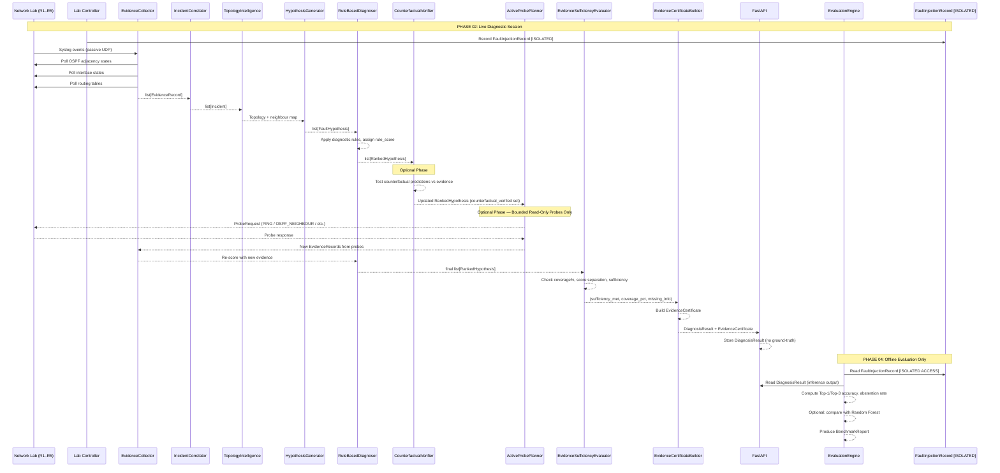
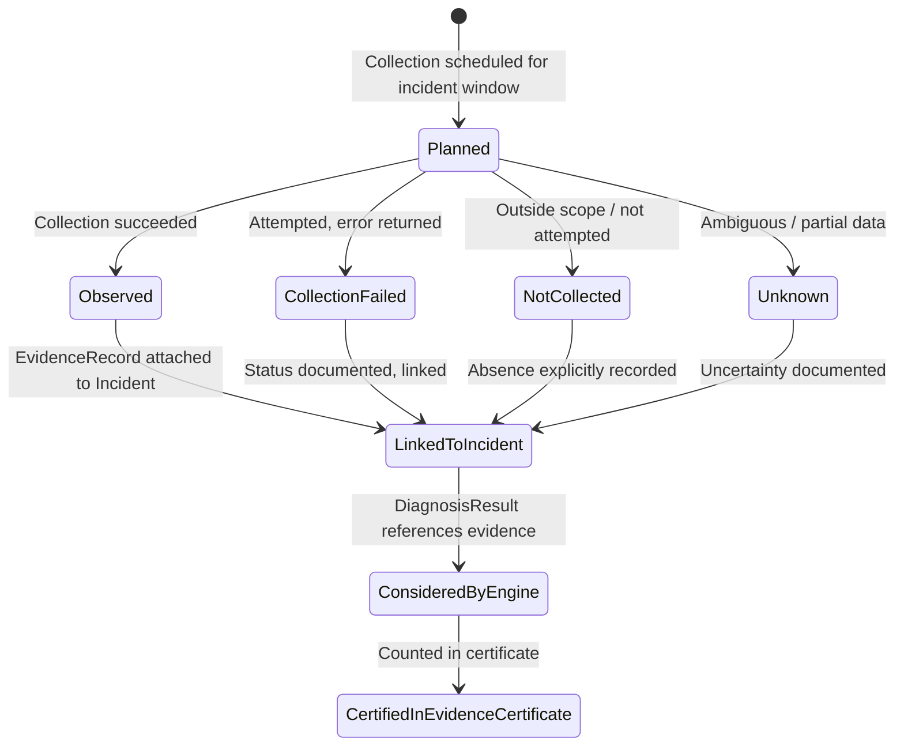

# NEXORA — Evidence and Diagnosis Data Flow

**Team**: A3-PS035-TC490 | **PS-035**

```mermaid
sequenceDiagram
    participant Lab as Network Lab (R1–R5)
    participant LC as Lab Controller
    participant EC as EvidenceCollector
    participant IC as IncidentCorrelator
    participant TI as TopologyIntelligence
    participant HG as HypothesisGenerator
    participant RBD as RuleBasedDiagnoser
    participant CV as CounterfactualVerifier
    participant APP as ActiveProbePlanner
    participant ESE as EvidenceSufficiencyEvaluator
    participant ECB as EvidenceCertificateBuilder
    participant API as FastAPI
    participant EE as EvaluationEngine
    participant GT as FaultInjectionRecord [ISOLATED]

    Note over Lab, GT: PHASE 02: Live Diagnostic Session

    LC ->> GT: Record FaultInjectionRecord [ISOLATED]
    Lab ->> EC: Syslog events (passive UDP)
    EC ->> Lab: Poll OSPF adjacency states
    EC ->> Lab: Poll interface states
    EC ->> Lab: Poll routing tables
    EC -->> IC: list[EvidenceRecord]

    IC -->> TI: list[Incident]
    TI -->> HG: Topology + neighbour map

    HG -->> RBD: list[FaultHypothesis]
    RBD -->> RBD: Apply diagnostic rules, assign rule_score
    RBD -->> CV: list[RankedHypothesis]

    Note over CV: Optional Phase
    CV -->> CV: Test counterfactual predictions vs evidence
    CV -->> APP: Updated RankedHypothesis (counterfactual_verified set)

    Note over APP: Optional Phase — Bounded Read-Only Probes Only
    APP -->> Lab: ProbeRequest (PING / OSPF_NEIGHBOUR / etc.)
    Lab -->> APP: Probe response
    APP -->> EC: New EvidenceRecords from probes
    EC -->> RBD: Re-score with new evidence

    RBD -->> ESE: final list[RankedHypothesis]
    ESE -->> ESE: Check coverage%, score separation, sufficiency
    ESE -->> ECB: (sufficiency_met, coverage_pct, missing_info)

    ECB -->> ECB: Build EvidenceCertificate
    ECB -->> API: DiagnosisResult + EvidenceCertificate

    API -->> API: Store DiagnosisResult (no ground-truth)

    Note over EE, GT: PHASE 04: Offline Evaluation Only
    EE ->> GT: Read FaultInjectionRecord [ISOLATED ACCESS]
    EE ->> API: Read DiagnosisResult (inference output)
    EE -->> EE: Compute Top-1/Top-3 accuracy, abstention rate
    EE -->> EE: Optional: compare with Random Forest
    EE -->> EE: Produce BenchmarkReport
```

---

## Evidence Record Lifecycle

```mermaid
stateDiagram-v2
    [*] --> Planned : Collection scheduled for incident window
    Planned --> Observed : Collection succeeded
    Planned --> NotCollected : Outside scope / not attempted
    Planned --> CollectionFailed : Attempted, error returned
    Planned --> Unknown : Ambiguous / partial data

    Observed --> LinkedToIncident : EvidenceRecord attached to Incident
    CollectionFailed --> LinkedToIncident : Status documented, linked
    NotCollected --> LinkedToIncident : Absence explicitly recorded
    Unknown --> LinkedToIncident : Uncertainty documented

    LinkedToIncident --> ConsideredByEngine : DiagnosisResult references evidence
    ConsideredByEngine --> CertifiedInEvidenceCertificate : Counted in certificate
```
